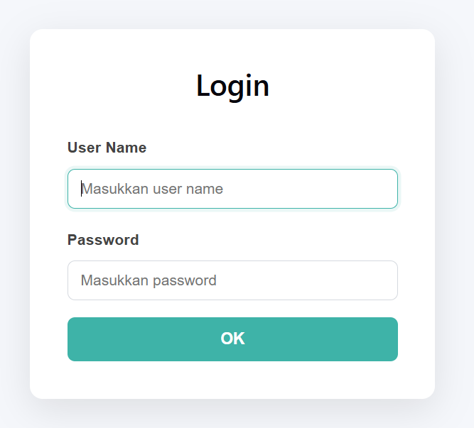

# Buku Panduan Penggunaan - TKA TryOut CBT & AI

Selamat datang di aplikasi TryOut berbasis *Computer-Based Test* (CBT) modern dengan dukungan Kecerdasan Buatan (AI). Buku panduan komprehensif ini akan membantu Anda mengoperasikan fitur-fitur dan mengenali antarmuka (UI) dari sudut pandang **Siswa**, **Guru**, dan **Administrator**.

---

## DAFTAR ISI
1. [Panduan Siswa](#1-panduan-siswa)
2. [Panduan Guru](#2-panduan-guru)
3. [Panduan Admin](#3-panduan-admin)

---

## 1. PANDUAN SISWA

Bagian ini dirancang untuk siswa/peserta ujian agar dapat mengerjakan soal TryOut dengan lancar dan aman.

### A. Halaman Login

*(Tangkapan Layar: Form Login Siswa)*

1. Buka aplikasi web TryOut pada browser Anda.
2. Pastikan Anda berada pada tab/menu **"Siswa"**.
3. Di dalam form, masukkan:
   - **Username**: NIS/NISN atau username yang telah diberikan oleh pihak sekolah.
   - **Password**: Kata sandi akun Anda.
4. Klik tombol **Login** berwarna biru. Jika berhasil, Anda akan dialihkan ke layar utama (Dashboard).

### B. Dashboard Siswa & Memilih Ujian

*(Tangkapan Layar: Dashboard Siswa & Daftar Tryout)*

1. Setelah login, Anda akan disambut oleh panel **Dashboard Siswa**.
2. Pada bagian tengah layar, terdapat tabel **"Daftar Ujian Aktif"** yang berisi:
   - Nama TryOut
   - Mata Pelajaran
   - Durasi (Menit)
   - Status Ujian (Mulai / Selesai)
3. Cari ujian yang jadwalnya sedang aktif, lalu klik tombol **"Mulai Mengerjakan"** (Ikon Play).
4. *Pop-up* konfirmasi akan muncul. Klik **"Ya, Mulai Sekarang"** untuk masuk ke lembar soal. Timer ujian akan langsung berjalan sejak Anda menekan tombol ini.

### C. Mengerjakan Ujian (Lembar CBT)

*(Tangkapan Layar: Navigasi Nomor Soal & Opsi Jawaban)*

Antarmuka lembar pengerjaan soal dibagi menjadi dua area utama:
- **Area Kiri (Lembar Soal):** Menampilkan teks pertanyaan beserta gambar (jika ada). Di bawahnya terdapat kotak-kotak opsi pilihan ganda (A, B, C, D) atau pernyataan (Benar/Salah).
- **Area Kanan (Navigasi):** Menampilkan kotak grid bernomor yang melambangkan urutan soal, serta indikator **Sisa Waktu** di bagian atas.

**Cara Menjawab:**
1. Klik pada salah satu tombol **Opsi Jawaban** yang menurut Anda benar. Tombol akan berubah warna menjadi tanda bahwa jawaban telah terpilih.
2. Klik tombol **Simpan & Lanjut** (di bagian bawah) untuk bergeser ke soal berikutnya.
3. Anda bisa menggunakan grid nomor di sebelah kanan untuk melompat bebas ke soal yang belum dijawab. Nomor berwarna abu-abu berarti belum dijawab, sedangkan warna solid berarti sudah terjawab.

> [!WARNING]
> Batas waktu ujian dihitung secara ketat oleh server. Jika indikator **Sisa Waktu** menyentuh angka 00:00:00, jawaban Anda akan langsung dikirim secara paksa (*auto-submit*).

### D. Mengakhiri Ujian & Melihat Hasil

*(Tangkapan Layar: Skor dan Tombol Pembahasan)*

1. Pada soal terakhir, tombol navigasi akan berubah menjadi **"Selesai & Kumpulkan"**. Klik tombol tersebut jika Anda sudah yakin dengan seluruh jawaban Anda.
2. Anda akan dikembalikan ke Dashboard.
3. Navigasikan ke menu **"Riwayat Ujian"** di *sidebar* sebelah kiri.
4. Anda bisa melihat total skor Anda, jumlah jawaban Benar, Salah, dan Kosong.
5. Untuk mengevaluasi kelemahan Anda, klik tombol **"Lihat Pembahasan"**. Halaman ini akan memuat penjelasan langkah demi langkah mengapa jawaban Anda keliru, yang disusun secara mendalam oleh AI.

---

## 2. PANDUAN GURU

Sebagai Guru, Anda memiliki akses penuh (melalui sidebar spesifik guru) untuk menyusun bank soal, mengelola paket tryout, dan menggunakan fitur kecerdasan buatan (AI) untuk membantu membuat dan membahas soal dalam sekejap.

### A. Manajemen Bank Soal

*(Tangkapan Layar: Tabel Daftar Soal & Menu Tambah Soal)*

1. Masuk ke menu **Bank Soal** pada *sidebar* sebelah kiri.
2. Tabel akan menampilkan daftar soal yang telah Anda buat beserta filter mata pelajarannya.
3. Untuk membuat soal manual:
   - Klik tombol **"+ Tambah Soal"** di sudut kanan atas.
   - Pilih jenis soal (Pilihan Ganda, Benar-Salah, dll).
   - Ketik pertanyaan di kolom Editor. Anda juga bisa mengunggah file gambar ke dalam soal dengan menekan tombol **Upload Gambar**.
   - Isi opsi jawaban (A, B, C, D) lalu centang *radio button* (titik bulat) pada opsi yang merupakan **Kunci Jawaban**.

### B. Menggunakan Fitur "Import Soal dari Gambar" (AI Vision)

*(Tangkapan Layar: Kotak Upload Gambar Soal)*

Fitur revolusioner ini sangat menghemat waktu Anda jika Anda memiliki soal dari buku cetak atau PDF ujian tahun lalu.
1. Masih di halaman Bank Soal, klik tombol **"Import dari Gambar"**.
2. Anda akan melihat sebuah area *dropzone*. Tarik file gambar (*.png, *.jpg) ke area tersebut atau klik untuk memilih file. (Sangat disarankan memakai fitur *Screenshot/Snipping Tool* dari Windows untuk mengambil gambar soal dari layar komputer).
3. Klik **Mulai Ekstrak**.
4. Aplikasi akan bekerja. AI Vision akan menyalin teks soal dan mendeteksi opsi jawabannya secara otomatis. Anda cukup meninjau kebenarannya dan menekan tombol **Simpan**!

> [!NOTE]
> Kemampuan membaca gambar sangat bergantung pada kejelasan resolusi foto dan performa "Mesin AI" yang dikonfigurasikan oleh Admin.

### C. Membuat Pembahasan Cerdas dengan AI

*(Tangkapan Layar: Tiga Tombol Ajaib Pembahasan)*

Alih-alih mengetik pembahasan yang rumit satu per satu, manfaatkan tombol Ajaib AI.
1. Saat sedang mengisi form Edit/Tambah Soal, *scroll* layar hingga ke bagian kolom "Pembahasan".
2. Di sana terdapat grup tombol **AI Assistant**:
   - `[🔍 Verifikasi Jawaban]`: Meminta AI untuk bertindak sebagai *proofreader*. AI akan mengecek silang apakah kunci jawaban yang Anda pilih sudah selaras dengan logika keilmuan.
   - `[✨ Bahas Singkat]`: AI akan menghasilkan draf pembahasan *to-the-point* (maksimal 2-4 kalimat). Cocok untuk pelajaran sejarah, sosiologi, atau bahasa.
   - `[📚 Bahas Detail]`: AI akan menguraikan konsep dasar, menjabarkan status satu per satu opsi, hingga penarikan kesimpulan. Cocok untuk Matematika, Fisika, dan Eksakta.
3. Setelah proses *loading* selesai, teks pembahasan akan muncul di kotak editor. Anda bebas merevisinya secara manual sebelum menekan **Simpan**.

### D. Manajemen TryOut (Paket Ujian)
1. Buka menu **TryOut** di sidebar.
2. Klik **"+ Buat TryOut"**.
3. Isi parameter ujian: Nama Paket, Deskripsi (misal: "Kelas Unggulan"), Durasi, dan Batas Waktu pengerjaan (Buka/Tutup).
4. Setelah terbuat, klik tombol **"Atur Soal"** (Ikon Puzzle) pada baris tryout tersebut.
5. Anda bisa langsung "Mencomot" soal-soal dari Bank Soal ke dalam keranjang Tryout Anda.

---

## 3. PANDUAN ADMIN

Panel Admin memegang kendali atas infrastruktur sekolah, hak akses (*roles*), dan pengaturan kapabilitas AI yang mendasari semua fitur *smart* di aplikasi ini.

### A. Manajemen User (Pengguna)

*(Tangkapan Layar: Tabel Siswa dan Guru)*

1. Buka menu **Manajemen Pengguna**.
2. Anda akan melihat sub-menu untuk Siswa dan Guru.
3. Klik **Tambah User** untuk mendaftarkan akun baru.
4. Di panel ini juga, Admin memiliki otoritas tertinggi untuk mereset kata sandi atau memblokir akun pengguna yang bermasalah.

### B. Konfigurasi Mesin Kecerdasan Buatan (AI)

*(Tangkapan Layar: Pilihan Mode Gemini dan Ollama)*

Sistem ini mendukung transisi mulus antara AI berbasis Cloud dan Offline.
1. Buka menu **Pengaturan** -> Tab **Kecerdasan Buatan (AI)**.
2. Pilih "Mesin Utama" yang akan diaktifkan untuk fitur *Import Gambar* dan *Bahas Soal Otomatis*:
   - **Gemini API (Cloud):** Sangat cepat, pintar, namun butuh koneksi internet. Admin wajib menempelkan (*paste*) **API Key** yang valid pada kolom yang disediakan.
   - **Ollama (Lokal):** Sedikit lebih lambat namun data 100% rahasia karena dijalankan di server sekolah sendiri tanpa butuh kuota internet. Pastikan nilai `Ollama Base URL` terisi (default: `http://localhost:11434`) dan nama model AI yang diinstal telah sesuai.
3. Klik **Simpan Pengaturan**. Perubahan ini akan seketika itu juga dirasakan dampaknya oleh Guru-Guru yang sedang merakit soal.

### C. Jaringan Lokal & Server LAN

*(Tangkapan Layar: Panel IP Address)*

1. Pada menu **Pengaturan**, buka Tab **Jaringan**.
2. Jika Anda menjadikan Laptop/PC Anda sebagai *Server Ujian* (dengan menjalankan skrip `run_server.py`), panel ini akan otomatis melacak IP Lokal Anda (contoh: `http://192.168.1.15:5173`).
3. Anda cukup menuliskan alamat IP tersebut di papan tulis kelas, lalu seluruh HP dan Laptop Siswa yang tersambung ke jaringan WiFi (atau *tethering*) yang sama dapat langsung mengerjakan ujian secara lancar tanpa hambatan kuota!

### D. Backup Database Rutin
1. Buka menu **Keamanan & Backup**.
2. Untuk mendownload rekaman basis data (SQLite) saat ini juga, klik **Backup Sekarang**.
3. Jika menggunakan platform Docker, backup harian otomatis telah terjadwal secara *background*. File akan disimpan aman di dalam volume `/backups`.
